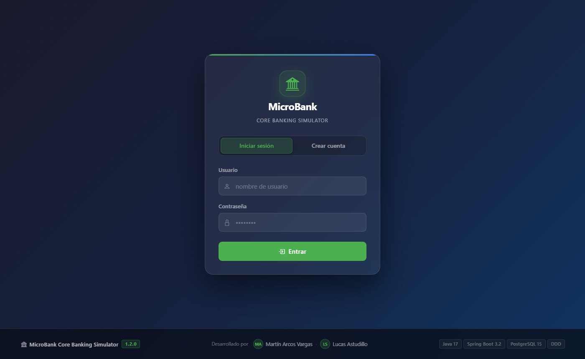
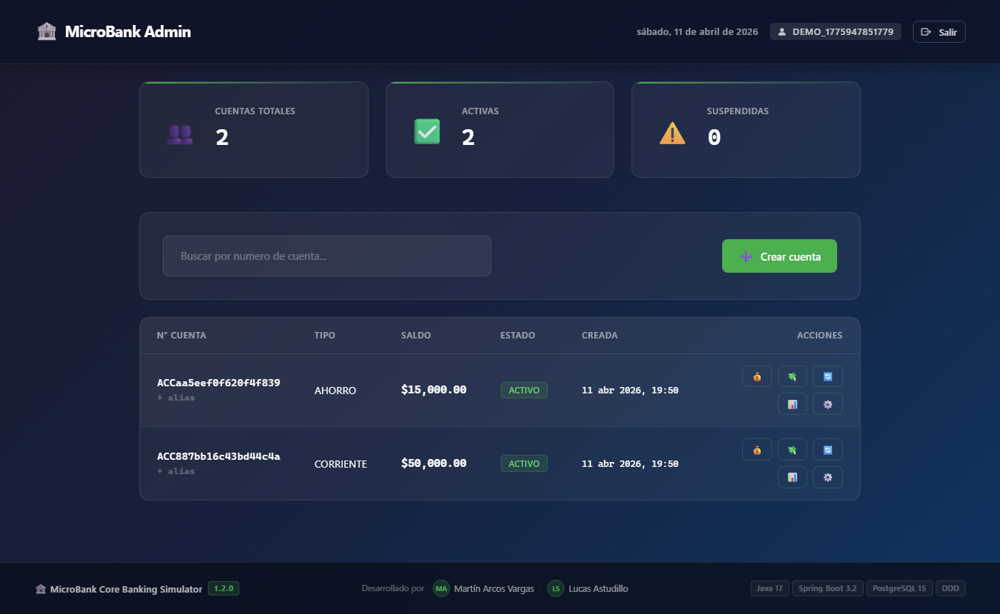
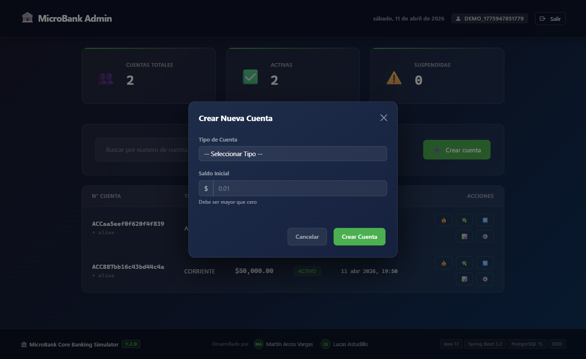
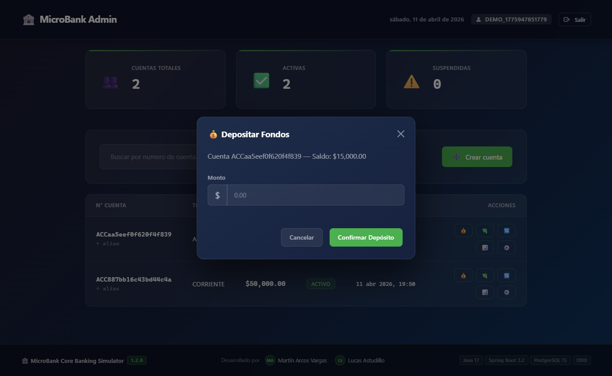

<div align="center">

# 🏦 MicroBank
### Core Banking Simulator

*Simulador bancario de alta integridad — DDD · Transacciones ACID · JWT · Pessimistic Locking*

<br>

[](https://adoptium.net/)
[](https://spring.io/projects/spring-boot)
[](https://www.postgresql.org/)
[](https://www.docker.com/)
[](https://jwt.io/)
[](https://flywaydb.org/)

<br>

[](https://junit.org/junit5/)
[](https://www.jacoco.org/)
[](https://github.com/cozakoo/MicroBank_Core_Banking_Simulator/releases)
[](https://github.com/cozakoo/MicroBank_Core_Banking_Simulator)
[](https://github.com/cozakoo/MicroBank_Core_Banking_Simulator/actions)

<br>

**[📊 Dashboard](http://localhost:8080) &nbsp;·&nbsp; [📖 Swagger UI](http://localhost:8080/swagger-ui.html) &nbsp;·&nbsp; [📋 Documentación del Dashboard](DASHBOARD.md)**

</div>

---

## 🖼️ Vista Previa

<table>
  <tr>
    <td align="center" width="50%">
      <b>🔐 Login & Registro</b><br><br>
      
    </td>
    <td align="center" width="50%">
      <b>📊 Dashboard Admin</b><br><br>
      
    </td>
  </tr>
  <tr>
    <td align="center" width="50%">
      <b>➕ Crear Cuenta</b><br><br>
      
    </td>
    <td align="center" width="50%">
      <b>💰 Operaciones Financieras</b><br><br>
      
    </td>
  </tr>
</table>

---

## ✨ Funcionalidades

<table>
  <tr>
    <td width="33%" valign="top">
      <h3>🔐 Seguridad</h3>
      <ul>
        <li>Autenticación JWT stateless (24h)</li>
        <li>Registro e inicio de sesión</li>
        <li>Roles ADMIN / USER</li>
        <li>Spring Security integrado</li>
      </ul>
    </td>
    <td width="33%" valign="top">
      <h3>💳 Cuentas</h3>
      <ul>
        <li>Tipos: Corriente, Ahorro, Crédito</li>
        <li>Alias únicos por cuenta</li>
        <li>Vinculadas al usuario dueño</li>
        <li>Estados: Activo / Suspendido / Cerrado</li>
      </ul>
    </td>
    <td width="33%" valign="top">
      <h3>💸 Transacciones</h3>
      <ul>
        <li>Depósitos y retiros</li>
        <li>Transferencias por UUID, número o alias</li>
        <li>Integridad ACID garantizada</li>
        <li>Pessimistic Locking anti-deadlock</li>
      </ul>
    </td>
  </tr>
  <tr>
    <td width="33%" valign="top">
      <h3>📋 Auditoría</h3>
      <ul>
        <li>Registro inmutable de toda operación</li>
        <li>Trazabilidad completa por cuenta</li>
        <li>Acceso exclusivo para ADMIN</li>
      </ul>
    </td>
    <td width="33%" valign="top">
      <h3>🛠️ Infraestructura</h3>
      <ul>
        <li>Docker Compose (app + BD + pgAdmin)</li>
        <li>Flyway para migraciones</li>
        <li>CI/CD con GitHub Actions</li>
        <li>Health endpoint</li>
      </ul>
    </td>
    <td width="33%" valign="top">
      <h3>🧪 Calidad</h3>
      <ul>
        <li>61 tests (JUnit 5 + Mockito)</li>
        <li>Tests de integración con H2</li>
        <li>Cobertura > 80% en dominio</li>
        <li>Swagger / OpenAPI documentado</li>
      </ul>
    </td>
  </tr>
</table>

---

## 🚀 Inicio Rápido

### Con Docker (recomendado)

```bash
git clone https://github.com/cozakoo/MicroBank_Core_Banking_Simulator.git
cd MicroBank_Core_Banking_Simulator
docker-compose up --build
```

| Servicio | URL | Credenciales |
|---|---|---|
| 🌐 App | http://localhost:8080 | — |
| 🔐 Login | http://localhost:8080/login.html | Crear cuenta en el formulario |
| 📖 Swagger | http://localhost:8080/swagger-ui.html | — |
| 🗄️ pgAdmin | http://localhost:5050 | `admin@microbank.com` / `admin` |
| 🐘 PostgreSQL | localhost:5432 | `postgres` / `postgres` |

### Local (con PostgreSQL instalado)

```bash
mvn clean install
mvn spring-boot:run

# Verificar
curl http://localhost:8080/api/v1/health
```

### Híbrido (BD en Docker, app local)

```bash
docker-compose up postgres pgadmin -d
mvn spring-boot:run
```

---

## 🏗️ Arquitectura

```
┌──────────────────────────────────────────────────────┐
│          Frontend — HTML5 + Bootstrap 5 + JS         │
│           Dashboard Admin  ·  Login Page             │
└─────────────────────┬────────────────────────────────┘
                      │ HTTP / JWT Bearer
┌─────────────────────▼────────────────────────────────┐
│              Presentation Layer (REST)               │
│   AuthController · AccountController · Transfer...  │
└─────────────────────┬────────────────────────────────┘
                      │
┌─────────────────────▼────────────────────────────────┐
│              Application Layer (Services)            │
│   AccountService · TransferService · AuditService   │
└─────────────────────┬────────────────────────────────┘
                      │
┌─────────────────────▼────────────────────────────────┐
│               Domain Layer (DDD)                     │
│         Entities · Repositories · Enums              │
└─────────────────────┬────────────────────────────────┘
                      │ JPA + Pessimistic Locking
┌─────────────────────▼────────────────────────────────┐
│              PostgreSQL 15 + Flyway                  │
└──────────────────────────────────────────────────────┘
```

---

## 📡 API Reference

#### Auth — públicos
| Método | Endpoint | Descripción |
|---|---|---|
| `POST` | `/api/v1/auth/register` | Registrar usuario → retorna JWT |
| `POST` | `/api/v1/auth/login` | Login → retorna JWT |

#### Cuentas — requieren JWT
| Método | Endpoint | Descripción |
|---|---|---|
| `GET` | `/api/v1/accounts` | Mis cuentas |
| `POST` | `/api/v1/accounts` | Crear cuenta |
| `GET` | `/api/v1/accounts/{id}` | Detalle por ID |
| `GET` | `/api/v1/accounts/search/{id}` | Buscar por número o alias |
| `PUT` | `/api/v1/accounts/{id}/status` | Cambiar estado |
| `PUT` | `/api/v1/accounts/{id}/alias` | Asignar alias |

#### Operaciones — requieren JWT
| Método | Endpoint | Descripción |
|---|---|---|
| `POST` | `/api/v1/accounts/{id}/deposit` | Depositar |
| `POST` | `/api/v1/accounts/{id}/withdraw` | Retirar |
| `POST` | `/api/v1/transfers` | Transferir (UUID, número o alias) |
| `GET` | `/api/v1/transfers/account/{id}` | Historial de transferencias |

#### Admin — requieren rol ADMIN
| Método | Endpoint | Descripción |
|---|---|---|
| `GET` | `/api/v1/admin/audit` | Log completo de auditoría |
| `GET` | `/api/v1/admin/audit/account/{id}` | Auditoría por cuenta |

> Explorá todos los endpoints con ejemplos en [Swagger UI](http://localhost:8080/swagger-ui.html)

---

## 🛠️ Stack Tecnológico

<table>
  <tr>
    <th>Categoría</th>
    <th>Tecnología</th>
  </tr>
  <tr>
    <td><b>Backend</b></td>
    <td>
      
      
      
    </td>
  </tr>
  <tr>
    <td><b>Base de datos</b></td>
    <td>
      
      
      
    </td>
  </tr>
  <tr>
    <td><b>Seguridad</b></td>
    <td>
      
      
    </td>
  </tr>
  <tr>
    <td><b>Frontend</b></td>
    <td>
      
      
    </td>
  </tr>
  <tr>
    <td><b>Infraestructura</b></td>
    <td>
      
      
    </td>
  </tr>
  <tr>
    <td><b>Testing</b></td>
    <td>
      
      
      
    </td>
  </tr>
  <tr>
    <td><b>Documentación</b></td>
    <td>
      
      
    </td>
  </tr>
</table>

---

## 🧪 Tests

```
mvn test                          # Ejecutar todos los tests
mvn test jacoco:report            # Con reporte de cobertura
```

```
✅ 61 tests pasando
├── Unit Tests    — Lógica de dominio (Mockito)
├── Integration   — H2 in-memory + Spring context
└── Security      — Endpoints protegidos por JWT
```

---

## 📁 Estructura del Proyecto

```
src/main/java/com/microbank/
├── auth/
│   ├── domain/          # User, UserRepository
│   ├── application/     # AuthService, JwtUtil, JwtAuthFilter
│   └── presentation/    # AuthController, DTOs
├── account/
│   ├── domain/          # Account, Transaction, Enums, Repositories
│   ├── application/     # AccountService, TransferService, DepositWithdrawService
│   └── presentation/    # Controllers, Response DTOs
├── audit/
│   ├── domain/          # AuditLog, AuditLogRepository
│   ├── application/     # AuditService
│   └── presentation/    # AuditController
├── shared/
│   ├── api/             # ApiResponse, GlobalExceptionHandler
│   └── exceptions/      # Excepciones de dominio propias
└── config/
    └── SecurityConfig.java

src/main/resources/
├── static/
│   ├── index.html       # Dashboard Admin
│   ├── login.html       # Login / Registro
│   ├── css/dashboard.css
│   └── js/app.js
└── db/migration/        # Flyway V1..V4
```

---

## 🗺️ Roadmap

| Fase | Estado | Descripción |
|---|---|---|
| Fase 1 — Dominio | ✅ | Entidades Account, Transaction, Repositories |
| Fase 2 — Lógica | ✅ | TransferService ACID, DepositWithdraw, Auditoría |
| Fase 3 — REST API | ✅ | 5 Controllers, Swagger, 50+ tests |
| Fase 4 — Infra | ✅ | Docker, CI/CD, Flyway, Spring Security, Dashboard |
| v1.2.0 — Auth & Alias | ✅ | JWT, cuentas por usuario, alias, transferencias flexibles |

---

## ❌ Solución de Problemas

| Problema | Solución |
|---|---|
| `Connection refused` | Verificar PostgreSQL: `pg_isready` |
| `Port 8080 in use` | `lsof -i :8080` → `kill -9 <PID>` |
| `Port 5432 in use` | PostgreSQL local corriendo — detenerlo o usar Docker |
| Docker no inicia | Verificar Docker Desktop y reiniciar |
| Tests fallan | Verificar `application-test.yml` con H2 habilitado |

---

## 👥 Equipo

<div align="center">

<a href="https://github.com/cozakoo/MicroBank_Core_Banking_Simulator/graphs/contributors">
  
</a>

<br><br>

| | Desarrollador | Rol |
|---|---|---|
|  | **[Martín Arcos Vargas](https://github.com/cozakoo)** | Backend · Frontend · DDD · Auth |
|  | **[Lucas Astudillo](https://github.com/Lkss01)** | Backend · Testing · Revisión |

</div>

---

## 📄 Documentación Adicional

- 📋 [DASHBOARD.md](DASHBOARD.md) — Guía completa del Dashboard Admin
- 🏛️ [ADR-001: Domain-Driven Design](docs/adr/ADR-001-domain-driven-design.md)
- 🔒 [ADR-002: Transacciones e Isolation](docs/adr/ADR-002-transaction-isolation.md)
- ⚠️ [ADR-003: Manejo de Errores](docs/adr/ADR-003-error-handling.md)
- 📖 [Swagger Setup](docs/SWAGGER_SETUP.md)

---

<div align="center">

**Licencia MIT** · v1.2.0 · Última actualización: Abril 2026

*Construido con ☕ Java, 💚 Spring Boot y muchas transferencias de prueba*

</div>
para detalles.

---

## 👨‍💻 Créditos Adicionales

### Herramientas & Tecnologías
- Spring Boot Team — Framework extraordinario
- PostgreSQL — Base de datos confiable
- Docker — Containerización
- Bootstrap — UI Framework
- Swagger/OpenAPI — Documentación de API

### Inspiración
- Domain-Driven Design (Eric Evans)
- Microservices Architecture (Sam Newman)
- Clean Code (Robert C. Martin)

---

*Última actualización: 11 de abril, 2026 — v1.2.0 (JWT Auth + Alias + Transferencias flexibles)*
*Estado: ✅ Completado, Documentado, Testeado y Listo para Usar*
para detalles.

---

## 👨‍💻 Créditos Adicionales

### Herramientas & Tecnologías
- Spring Boot Team — Framework extraordinario
- PostgreSQL — Base de datos confiable
- Docker — Containerización
- Bootstrap — UI Framework
- Swagger/OpenAPI — Documentación de API

### Inspiración
- Domain-Driven Design (Eric Evans)
- Microservices Architecture (Sam Newman)
- Clean Code (Robert C. Martin)

---

*Última actualización: 11 de abril, 2026 — v1.2.0 (JWT Auth + Alias + Transferencias flexibles)*
*Estado: ✅ Completado, Documentado, Testeado y Listo para Usar*
